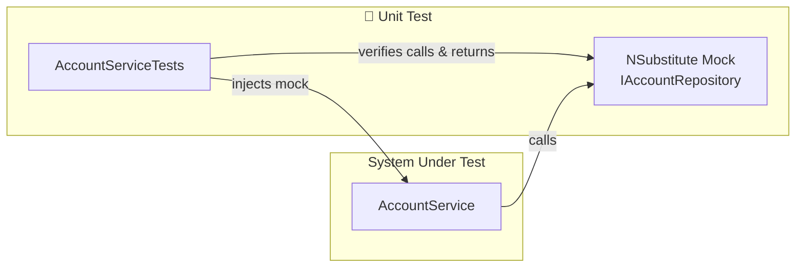
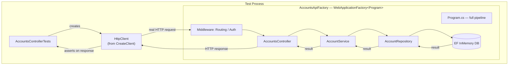
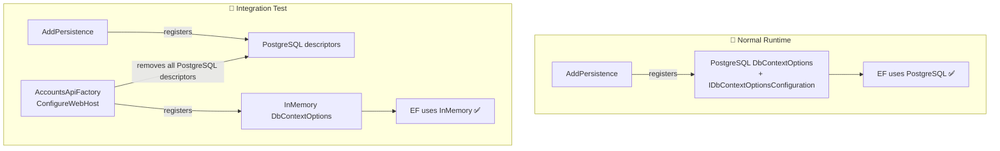
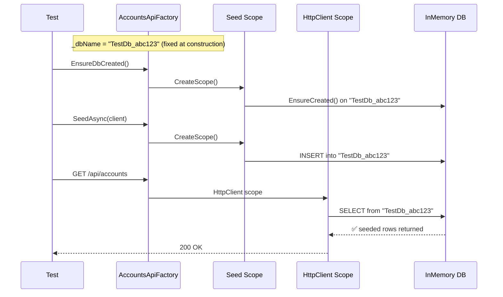
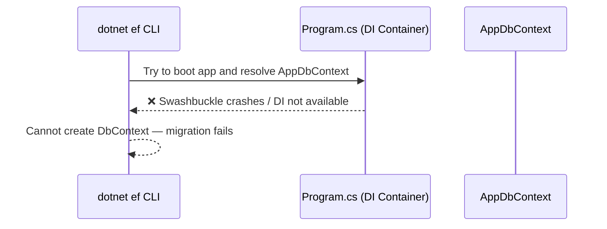
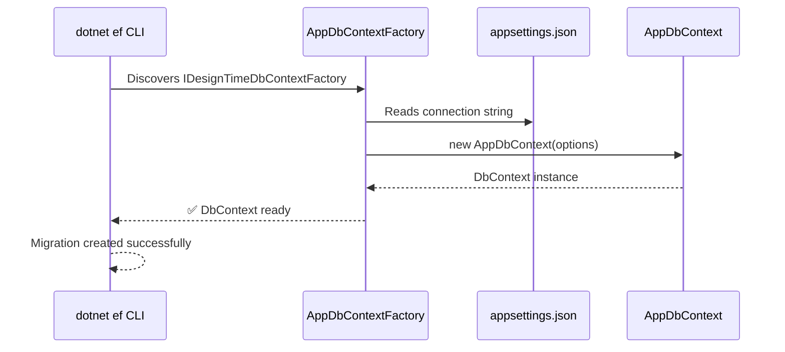

# account-service
This is an account service API in C#

## Project Structure

```
account-service/
├── account-service.sln
├── src/                                        # Main API project
│   ├── account-service.csproj
│   ├── Program.cs
│   ├── appsettings.json
│   ├── appsettings.Development.json
│   ├── Features/
│   │   └── Accounts/
│   │       ├── Account.cs
│   │       ├── AccountsController.cs
│   │       ├── AccountService.cs
│   │       ├── IAccountService.cs
│   │       ├── AccountRepository.cs
│   │       ├── IAccountRepository.cs
│   │       └── Dtos/
│   │           ├── AccountDto.cs
│   │           ├── CreateAccountDto.cs
│   │           └── UpdateAccountDto.cs
│   ├── Infrastructure/
│   │   └── Persistence/
│   │       ├── AppDbContext.cs
│   │       ├── AppDbContextFactory.cs
│   │       └── ServiceCollectionExtensions.cs
│   └── Migrations/
└── test/
    ├── unittest/                               # xUnit unit tests (NSubstitute mocks)
    │   ├── unittest.csproj
    │   └── Unit/
    │       └── Accounts/
    │           └── AccountServiceTests.cs
    └── integrationtest/                        # xUnit integration tests (real HTTP + in-memory DB)
        ├── integrationtest.csproj
        ├── AccountsApiFactory.cs
        └── Accounts/
            └── AccountsControllerTests.cs
```

---

## Quick Start

### Prerequisites

1. **.NET 10 SDK** — [Download here](https://dotnet.microsoft.com/download/dotnet/10.0)
2. **PostgreSQL 16+** — See installation options below
3. **EF Core CLI** — `dotnet tool install --global dotnet-ef`

### PostgreSQL Installation

Choose one of the following methods:

#### Option A: Homebrew (macOS)
```bash
brew install postgresql@16
brew services start postgresql@16

# Create the database
psql -U postgres -h localhost
CREATE DATABASE accounts;
\q
```

#### Option B: Docker (all platforms)
```bash
# Start PostgreSQL container
docker run --name postgres-dev \
  -e POSTGRES_PASSWORD=secret \
  -p 5432:5432 \
  -d postgres:16

# Create the database
docker exec -it postgres-dev psql -U postgres -c "CREATE DATABASE accounts;"
```

#### Option C: Download installer
- **Windows/macOS/Linux**: [PostgreSQL Downloads](https://www.postgresql.org/download/)

### Setup & Run

```bash
# 1. Clone and navigate to the project
cd account-service/src

# 2. Restore packages
dotnet restore

# 3. Update connection string in appsettings.json (if needed)
# Default: Host=localhost;Port=5432;Database=accounts;Username=postgres;Password=secret

# 4. Apply migrations
dotnet ef database update

# 5. Run the application
dotnet run
```

The API will be available at:
- **HTTP**: `http://localhost:5146`
- **OpenAPI spec**: `http://localhost:5146/openapi/v1.json` (Dev only)

### Run Tests
```bash
# All tests (unit + integration)
dotnet test account-service.sln

# Unit tests only
dotnet test test/unittest/unittest.csproj

# Integration tests only
dotnet test test/integrationtest/integrationtest.csproj
```

---

## Testing

### Running All Tests
```bash
dotnet test account-service.sln
```

### Running a Specific Test Project
```bash
dotnet test test/unittest/unittest.csproj
dotnet test test/integrationtest/integrationtest.csproj
```

---

## Unit Tests

Unit tests live in `test/unittest/` and use **xUnit v3** with **NSubstitute** for mocking.
They test `AccountService` in complete isolation — no HTTP stack, no database, no EF Core.

### Key packages
| Package | Version | Purpose |
|---|---|---|
| `xunit.v3` | 1.1.0 | Test framework |
| `xunit.runner.visualstudio` | 3.1.4 | IDE test runner |
| `NSubstitute` | 5.3.0 | Mock `IAccountRepository` |

### What is tested
| Test | Scenario |
|---|---|
| `GetAllAccounts_ReturnsAllAccounts` | Repository returns list → service maps to DTOs |
| `GetAllAccounts_ReturnsEmptyList` | Repository returns empty → service returns empty |
| `GetAccountById_ReturnsAccount` | Repository finds account → service returns DTO |
| `GetAccountById_ReturnsNull` | Repository returns null → service returns null |
| `CreateAccount_ReturnsCreatedAccount` | DTO mapped to entity → saved → returned as DTO |
| `CreateAccount_MapsAllFieldsFromDto` | All DTO fields correctly mapped to entity |
| `UpdateAccount_ReturnsUpdatedAccount` | Existing account updated → returned as DTO |
| `UpdateAccount_ReturnsNull_WhenNotFound` | Repository returns null → service returns null |
| `DeleteAccount_CallsRepository` | Repository `DeleteAsync` called with correct ID |
| `DeleteAccount_ReturnsFalse_WhenNotFound` | Repository returns false → service returns false |

### Architecture



---

## Integration Tests

Integration tests live in `test/integrationtest/` and use **xUnit v3** with
`Microsoft.AspNetCore.Mvc.Testing`. They spin up the **full ASP.NET Core pipeline** in-process and
send real HTTP requests — testing the entire stack from controller down to the database.

### Key packages
| Package | Version | Purpose |
|---|---|---|
| `xunit.v3` | 1.1.0 | Test framework |
| `Microsoft.AspNetCore.Mvc.Testing` | 10.0.0 | In-process test server |
| `Microsoft.EntityFrameworkCore.InMemory` | 10.0.0 | Replace PostgreSQL with in-memory DB |

### What is tested
| Test | Scenario |
|---|---|
| `GetAccounts_ReturnsEmptyList` | GET /api/accounts with no data → 200 + `[]` |
| `GetAccounts_ReturnsAllSeededAccounts` | GET /api/accounts after seeding → all accounts returned |
| `GetAccountById_ReturnsAccount` | GET /api/accounts/{id} → 200 + correct account |
| `GetAccountById_ReturnsNotFound` | GET /api/accounts/999 → 404 |
| `CreateAccount_ReturnsCreatedAccount` | POST /api/accounts → 201 + Location header + body |
| `CreateAccount_ReturnsBadRequest_WhenNameMissing` | POST with empty name → 400 |
| `UpdateAccount_ReturnsUpdatedAccount` | PUT /api/accounts/{id} → 200 + updated body |
| `UpdateAccount_ReturnsNotFound` | PUT /api/accounts/999 → 404 |
| `DeleteAccount_ReturnsNoContent_WhenDeleted` | DELETE /api/accounts/{id} → 204 |
| `DeleteAccount_ReturnsNotFound` | DELETE /api/accounts/999 → 404 |

### How `WebApplicationFactory` works

`WebApplicationFactory<Program>` boots the real ASP.NET Core application inside the test process
using a `TestServer` — no external port is needed. It wires up the full middleware pipeline, DI
container, and controller routing, so HTTP calls exercise every layer.



### How PostgreSQL is replaced with an in-memory database

`AddPersistence` in `Program.cs` registers PostgreSQL as the EF Core provider. `AccountsApiFactory`
overrides `ConfigureWebHost` to remove those registrations and substitute the in-memory provider
before the `TestServer` starts.

#### Why simple descriptor removal isn't enough

`AddDbContext` registers several internal service descriptors, including
`IDbContextOptionsConfiguration<TContext>`, which carries the PostgreSQL provider binding. Removing only
`DbContextOptions<AppDbContext>` leaves that descriptor behind, causing EF to see **two providers
registered** at runtime and throw:

```
System.InvalidOperationException: Services for database providers
'Npgsql.EntityFrameworkCore.PostgreSQL', 'Microsoft.EntityFrameworkCore.InMemory'
have been registered in the service provider.
```

The fix is to remove all EF-related descriptors by matching on known types and the
`IDbContextOptionsConfiguration` namespace prefix:

```csharp
var descriptors = services
    .Where(d => d.ServiceType == typeof(DbContextOptions<AppDbContext>)
             || d.ServiceType == typeof(AppDbContext)
             || (d.ServiceType.IsGenericType &&
                 d.ServiceType.GetGenericTypeDefinition() == typeof(DbContextOptions<>))
             || d.ServiceType.FullName?.StartsWith(
                 "Microsoft.EntityFrameworkCore.Infrastructure.IDbContextOptionsConfiguration") == true)
    .ToList();
foreach (var d in descriptors) services.Remove(d);
```



#### Why the database name must be a fixed field

If `UseInMemoryDatabase` receives `Guid.NewGuid()` inside the lambda, the GUID is generated
**on every DI scope resolution** — so the seed scope and the HTTP request scope get *different*
in-memory databases, and seeded data is invisible to the requests under test.

Capturing the name as a `readonly` field means it is evaluated once per factory instance, and every
scope shares the same database:

```csharp
// ✅ Correct — name evaluated once per factory instance
private readonly string _dbName = $"TestDb_{Guid.NewGuid()}";
services.AddDbContext<AppDbContext>(o => o.UseInMemoryDatabase(_dbName));

// ❌ Wrong — brand-new database on every scope resolution
services.AddDbContext<AppDbContext>(o => o.UseInMemoryDatabase($"TestDb_{Guid.NewGuid()}"));
```



---

## Upgrading to .NET 10

Follow these steps to upgrade the project from .NET 9 to .NET 10:

### 1. Update the Target Framework in `src/account-service.csproj`
Change:
```xml
<TargetFramework>net9.0</TargetFramework>
```
To:
```xml
<TargetFramework>net10.0</TargetFramework>
```

### 2. Update Package Versions in `src/account-service.csproj`
Bump all Microsoft packages from `9.0.x` to `10.0.x`:
```xml
<PackageReference Include="Microsoft.AspNetCore.OpenApi" Version="10.0.0" />
<PackageReference Include="Microsoft.EntityFrameworkCore" Version="10.0.0" />
<PackageReference Include="Npgsql.EntityFrameworkCore.PostgreSQL" Version="10.0.0-*" />
<PackageReference Include="Microsoft.EntityFrameworkCore.Design" Version="10.0.0" />
```

### 3. Restore & Build
```bash
dotnet restore
dotnet build
```

### 4. Update the EF Core CLI Tool (if installed globally)
```bash
dotnet tool update --global dotnet-ef
```

---

## Entity Framework Core

This project uses **EF Core** with **PostgreSQL**. You'll need a running PostgreSQL server.

### Prerequisites

#### 1. Install the EF Core CLI tool
```bash
dotnet tool install --global dotnet-ef
```
Verify it's installed:
```bash
dotnet ef --version
```

#### 2. Install and run PostgreSQL locally

**macOS (Homebrew):**
```bash
brew install postgresql@16
brew services start postgresql@16
```

**Docker (all platforms):**
```bash
docker run --name postgres-dev -e POSTGRES_PASSWORD=secret -p 5432:5432 -d postgres:16
```

**Create the database:**
```bash
# Using psql
psql -U postgres -h localhost
CREATE DATABASE accounts;
\q

# Or with Docker
docker exec -it postgres-dev psql -U postgres -c "CREATE DATABASE accounts;"
```

### Connection String
Configured in `src/appsettings.json`:
```json
"ConnectionStrings": {
  "DefaultConnection": "Host=localhost;Port=5432;Database=accounts;Username=postgres;Password=secret"
}
```
Update this with your actual PostgreSQL credentials.

### Creating a Migration
EF Core CLI commands must be run from the `src/` folder:
```bash
cd src
dotnet ef migrations add <MigrationName>
```
Example:
```bash
dotnet ef migrations add InitialCreate
```
Migration files are generated in `src/Migrations/` — **commit these to source control**.

### Applying Migrations to the Database
```bash
cd src
dotnet ef database update
```
This creates the database (if it doesn't exist) and applies all pending migrations.

### Reverting a Migration
Revert to a specific migration by name:
```bash
dotnet ef database update <PreviousMigrationName>
```
Or revert all migrations (empty database):
```bash
dotnet ef database update 0
```

### Removing the Last Migration
If you haven't applied the migration to the database yet:
```bash
dotnet ef migrations remove
```

If you **have already applied** the migration, you must revert it first, then remove:
```bash
dotnet ef database update <PreviousMigrationName>  # revert to the migration before it
dotnet ef migrations remove                         # then delete the migration files
```
To revert all migrations (back to empty database):
```bash
dotnet ef database update 0
dotnet ef migrations remove
```

> ⚠️ **Never manually delete migration files** from `src/Migrations/` — always use
> `dotnet ef migrations remove`. Manual deletion will cause the migration history to go out of sync
> with `AppDbContextModelSnapshot.cs`, breaking future migrations.

### Listing Migrations
```bash
cd src
dotnet ef migrations list
```

### Switching to a Different Database Provider

> ⚠️ Migrations are **provider-specific** — the generated SQL differs per database. For example,
> a `decimal` column maps to `numeric(18,2)` in PostgreSQL and `decimal(18,2)` in SQL Server.
> You must regenerate migrations whenever you switch providers.

#### Option A — You have access to the existing database (local dev)

```bash
# 1. Revert the old database fully (while still on the OLD provider)
dotnet ef database update 0

# 2. Remove all existing migrations (repeat until none remain)
dotnet ef migrations remove

# 3. Swap the provider (see code changes below)

# 4. Recreate migrations with the new provider
dotnet ef migrations add InitialCreate

# 5. Apply to the new database
dotnet ef database update
```

#### Option B — Moving to a cloud/hosted database (e.g. Azure SQL, Supabase, Neon)

You won't have a local copy of the old database to revert. In this case it's safe to start fresh:

```bash
# 1. Delete the entire src/Migrations/ folder
rm -rf src/Migrations/

# 2. Swap the provider (see code changes below)

# 3. Recreate migrations fresh for the new provider
dotnet ef migrations add InitialCreate

# 4. Apply directly to the new cloud database
dotnet ef database update
```

#### Code changes required when swapping providers

**`src/account-service.csproj`** — replace the NuGet package:
| From (current) | To |
|---|---|
| `Npgsql.EntityFrameworkCore.PostgreSQL` | `Microsoft.EntityFrameworkCore.SqlServer` (SQL Server) |

**`src/Infrastructure/Persistence/ServiceCollectionExtensions.cs`** — swap the provider method:
```csharp
// Current: PostgreSQL
options.UseNpgsql(connectionString)

// SQL Server
options.UseSqlServer(connectionString)
```

**`src/Infrastructure/Persistence/AppDbContextFactory.cs`** — apply the same swap as above.

**`src/appsettings.json`** — update the connection string:
```json
// Current: PostgreSQL
"DefaultConnection": "Host=localhost;Port=5432;Database=accounts;Username=postgres;Password=secret"

// SQL Server
"DefaultConnection": "Server=localhost;Database=AccountsDb;User Id=sa;Password=secret"
```

---

## Known Issues & Fixes

### Problem 1: Swashbuckle incompatibility with .NET 10

**Symptom:** Running `dotnet ef migrations add` fails with:
```
Method 'GetSwagger' in type 'SwaggerGenerator' does not have an implementation.
```

**Cause:** `Swashbuckle.AspNetCore 8.x` is not compatible with .NET 10. When EF tries to boot the app
to resolve the service provider, Swashbuckle crashes before `AppDbContext` can be registered.

**Fix:** Upgrade to `Swashbuckle.AspNetCore 9.0.1` or later:
```bash
dotnet add package Swashbuckle.AspNetCore --version 9.0.1
```

---

### Problem 2: Missing Design-Time DbContext Factory

**Symptom:** Running `dotnet ef migrations add` fails with:
```
Unable to create a 'DbContext' of type 'AppDbContext'.
Unable to resolve service for type 'DbContextOptions<AppDbContext>'.
```

**Cause:** The `dotnet ef` CLI tool runs outside of the normal ASP.NET Core pipeline. It cannot boot
`Program.cs` to access the DI container where `AppDbContext` is registered — so it cannot
instantiate the `DbContext` on its own.

**Fix:** Add an `IDesignTimeDbContextFactory<AppDbContext>` implementation. EF automatically
discovers it at design time and uses it to create the `DbContext` without needing the full app.

#### How migration works — without vs with the factory

**Without factory (broken):**


**With factory (working):**


#### Where the factory fits in the overall architecture


The factory is **only used by the CLI** — it has no effect at runtime. It mirrors the same
connection string and provider as `ServiceCollectionExtensions.cs`, so they must be kept in sync
when switching database providers.


