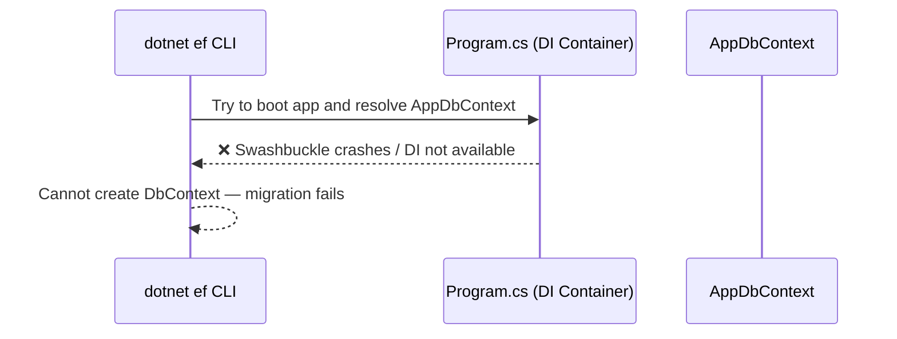
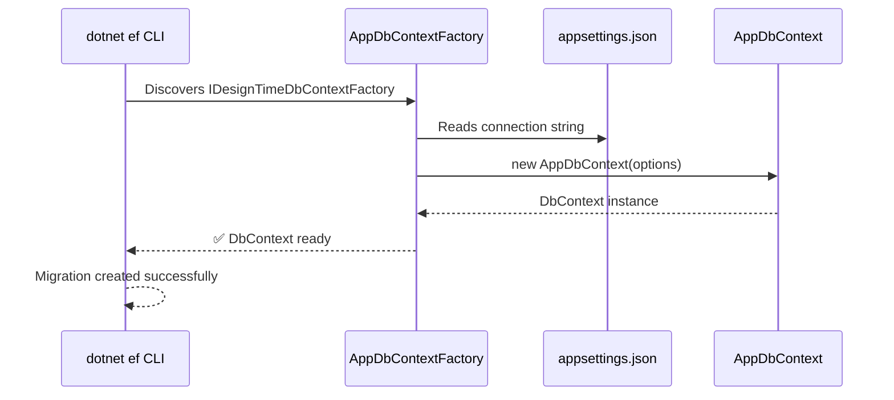
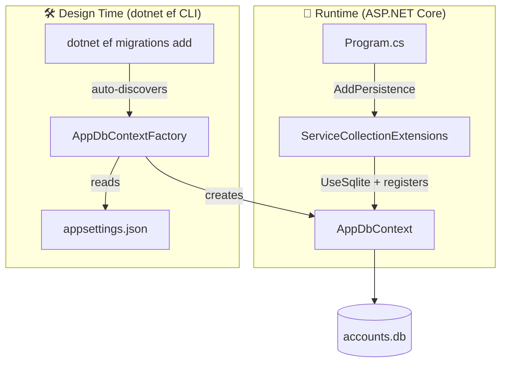

# account-service
This is an account service API in C#

## Project Structure

```
account-service/
├── account-service.sln
├── src/                                        # Main API project
│   ├── account-service.csproj
│   ├── Program.cs
│   ├── appsettings.json
│   ├── appsettings.Development.json
│   ├── Features/
│   │   └── Accounts/
│   │       ├── Account.cs
│   │       ├── AccountsController.cs
│   │       ├── AccountService.cs
│   │       ├── IAccountService.cs
│   │       ├── AccountRepository.cs
│   │       ├── IAccountRepository.cs
│   │       └── Dtos/
│   │           ├── AccountDto.cs
│   │           ├── CreateAccountDto.cs
│   │           └── UpdateAccountDto.cs
│   ├── Infrastructure/
│   │   └── Persistence/
│   │       ├── AppDbContext.cs
│   │       ├── AppDbContextFactory.cs
│   │       └── ServiceCollectionExtensions.cs
│   └── Migrations/
└── test/
    └── unittest/                               # xUnit unit tests
        ├── unittest.csproj
        └── Unit/
            └── Accounts/
                └── AccountServiceTests.cs
```

## Upgrading to .NET 10

Follow these steps to upgrade the project from .NET 9 to .NET 10:

### 1. Update the Target Framework in `src/account-service.csproj`
Change:
```xml
<TargetFramework>net9.0</TargetFramework>
```
To:
```xml
<TargetFramework>net10.0</TargetFramework>
```

### 2. Update Package Versions in `src/account-service.csproj`
Bump all Microsoft packages from `9.0.x` to `10.0.x`:
```xml
<PackageReference Include="Microsoft.AspNetCore.OpenApi" Version="10.0.0" />
<PackageReference Include="Microsoft.EntityFrameworkCore" Version="10.0.0" />
<PackageReference Include="Microsoft.EntityFrameworkCore.Sqlite" Version="10.0.0" />
<PackageReference Include="Microsoft.EntityFrameworkCore.Design" Version="10.0.0" />
```
> Leave `Swashbuckle.AspNetCore` as-is until a .NET 10 compatible version is available.

### 3. Restore & Build
```bash
dotnet restore
dotnet build
```

### 4. Update the EF Core CLI Tool (if installed globally)
```bash
dotnet tool update --global dotnet-ef
```

---

## Entity Framework Core

This project uses **EF Core** with **SQLite** by default. The database file (`accounts.db`) is created automatically in `src/`.

### Prerequisites — Install the EF Core CLI tool
```bash
dotnet tool install --global dotnet-ef
```
Verify it's installed:
```bash
dotnet ef --version
```

### Connection String
Configured in `src/appsettings.json`:
```json
"ConnectionStrings": {
  "DefaultConnection": "Data Source=accounts.db"
}
```
To switch databases, update `src/Infrastructure/Persistence/ServiceCollectionExtensions.cs` with the appropriate provider and update the connection string here.

### Creating a Migration
EF Core CLI commands must be run from the `src/` folder:
```bash
cd src
dotnet ef migrations add <MigrationName>
```
Example:
```bash
dotnet ef migrations add InitialCreate
```
Migration files are generated in `src/Migrations/` — **commit these to source control**.

### Applying Migrations to the Database
```bash
cd src
dotnet ef database update
```
This creates the database (if it doesn't exist) and applies all pending migrations.

### Reverting a Migration
Revert to a specific migration by name:
```bash
dotnet ef database update <PreviousMigrationName>
```
Or revert all migrations (empty database):
```bash
dotnet ef database update 0
```

### Removing the Last Migration
If you haven't applied the migration to the database yet:
```bash
dotnet ef migrations remove
```

If you **have already applied** the migration, you must revert it first, then remove:
```bash
dotnet ef database update <PreviousMigrationName>  # revert to the migration before it
dotnet ef migrations remove                         # then delete the migration files
```
To revert all migrations (back to empty database):
```bash
dotnet ef database update 0
dotnet ef migrations remove
```

> ⚠️ **Never manually delete migration files** from `src/Migrations/` — always use
> `dotnet ef migrations remove`. Manual deletion will cause the migration history to go out of sync
> with `AppDbContextModelSnapshot.cs`, breaking future migrations.

### Listing Migrations
```bash
cd src
dotnet ef migrations list
```

### Switching to a Different Database Provider

> ⚠️ Migrations are **provider-specific** — the generated SQL differs per database. For example,
> a `decimal` column maps to `TEXT` in SQLite, `numeric(18,2)` in PostgreSQL, and `decimal(18,2)`
> in SQL Server. You must regenerate migrations whenever you switch providers.

#### Option A — You have access to the existing database (local dev)

```bash
# 1. Revert the old database fully (while still on the OLD provider)
dotnet ef database update 0

# 2. Remove all existing migrations (repeat until none remain)
dotnet ef migrations remove

# 3. Swap the provider (see code changes below)

# 4. Recreate migrations with the new provider
dotnet ef migrations add InitialCreate

# 5. Apply to the new database
dotnet ef database update
```

#### Option B — Moving to a cloud/hosted database (e.g. Azure SQL, Supabase, Neon)

You won't have a local copy of the old database to revert. In this case it's safe to start fresh:

```bash
# 1. Delete the entire src/Migrations/ folder
rm -rf src/Migrations/

# 2. Swap the provider (see code changes below)

# 3. Recreate migrations fresh for the new provider
dotnet ef migrations add InitialCreate

# 4. Apply directly to the new cloud database
dotnet ef database update
```

#### Code changes required when swapping providers

**`src/account-service.csproj`** — replace the NuGet package:
| From | To |
|---|---|
| `Microsoft.EntityFrameworkCore.Sqlite` | `Npgsql.EntityFrameworkCore.PostgreSQL` (PostgreSQL) |
| `Microsoft.EntityFrameworkCore.Sqlite` | `Microsoft.EntityFrameworkCore.SqlServer` (SQL Server) |

**`src/Infrastructure/Persistence/ServiceCollectionExtensions.cs`** — swap the provider method:
```csharp
// PostgreSQL
options.UseNpgsql(connectionString)

// SQL Server
options.UseSqlServer(connectionString)
```

**`src/Infrastructure/Persistence/AppDbContextFactory.cs`** — apply the same swap as above.

**`src/appsettings.json`** — update the connection string:
```json
// PostgreSQL
"DefaultConnection": "Host=localhost;Database=accounts;Username=postgres;Password=secret"

// SQL Server
"DefaultConnection": "Server=localhost;Database=AccountsDb;User Id=sa;Password=secret"
```

---

## Known Issues & Fixes

### Problem 1: Swashbuckle incompatibility with .NET 10

**Symptom:** Running `dotnet ef migrations add` fails with:
```
Method 'GetSwagger' in type 'SwaggerGenerator' does not have an implementation.
```

**Cause:** `Swashbuckle.AspNetCore 8.x` is not compatible with .NET 10. When EF tries to boot the app
to resolve the service provider, Swashbuckle crashes before `AppDbContext` can be registered.

**Fix:** Upgrade to `Swashbuckle.AspNetCore 9.0.1` or later:
```bash
dotnet add package Swashbuckle.AspNetCore --version 9.0.1
```

---

### Problem 2: Missing Design-Time DbContext Factory

**Symptom:** Running `dotnet ef migrations add` fails with:
```
Unable to create a 'DbContext' of type 'AppDbContext'.
Unable to resolve service for type 'DbContextOptions<AppDbContext>'.
```

**Cause:** The `dotnet ef` CLI tool runs outside of the normal ASP.NET Core pipeline. It cannot boot
`Program.cs` to access the DI container where `AppDbContext` is registered — so it cannot
instantiate the `DbContext` on its own.

**Fix:** Add an `IDesignTimeDbContextFactory<AppDbContext>` implementation. EF automatically
discovers it at design time and uses it to create the `DbContext` without needing the full app.

#### How migration works — without vs with the factory

**Without factory (broken):**


**With factory (working):**


#### Where the factory fits in the overall architecture



The factory is **only used by the CLI** — it has no effect at runtime. It mirrors the same
connection string and provider as `ServiceCollectionExtensions.cs`, so they must be kept in sync
when switching database providers.


